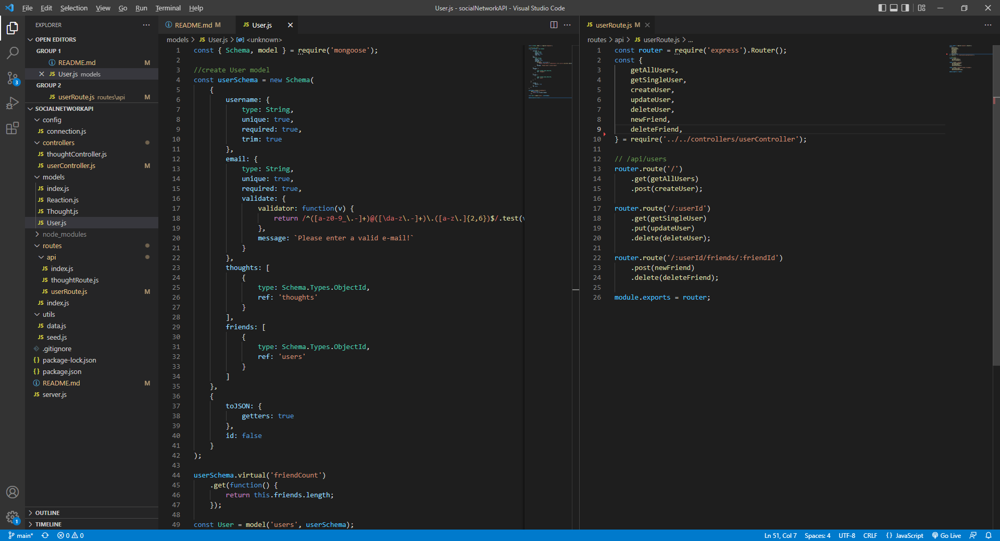
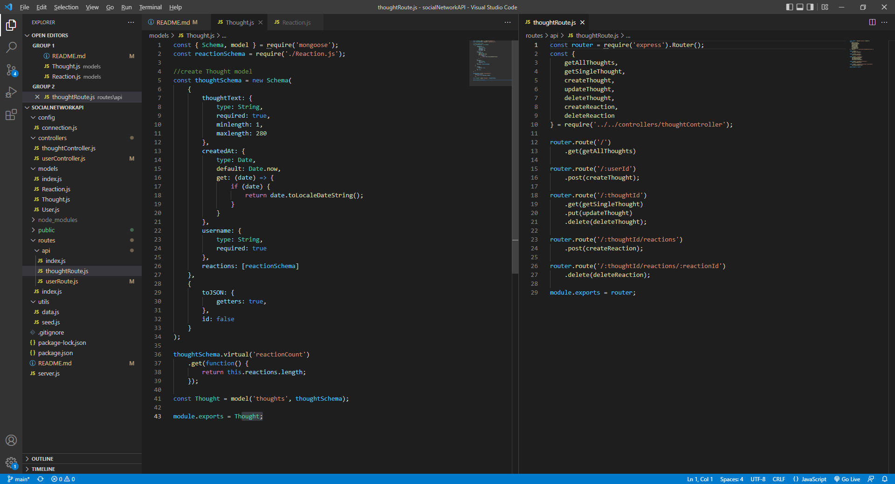

# socialNetworkAPI

## Description

This app is a database that allows a developer to add Users 
to a database within MongoDB. The developer can also create 
thoughts with a relationship to the User schema as well as 
posting reactions to those thoughts. This app was developed 
to learn the basic aspects of the npm mongoose MongoDB. The 
database can be used and seen as a basic social media workspace. 

## Learned

- Connect to MongoDB
- Modify documents in MongoDB
- Utilize mongoose
- Create models and schema with mongoose
- Create virtuals within schema
- Seed data through mongoose
- Export through controller

## Table of Contents

- [Description](#description)
- [Learned](#learned)
- [Installation](#installation)
- [Usage](#usage)
- [Credits](#credits)
- [Features](#features)

## Installation

NPM | Notes
--- | ---
express | Connection to locally hosted server
mongoose | Connection to MongoDB and easier MongoDB code handling

Database | Database name (required)
--- | ---
MongoDB | socialNetworkDB

## Usage

After acquiring code and installing all dependencies, connect to and create database  
by running `cd utils node seed` within the terminal. The application needs data 
to be able to view database properly. Run `node server` in the terminal from the root to activate 
local host. Open postman or insomnia to use routes and use basic CRUD operations to manipulate the 
database. 

**(VIDEO)** _SEEDING and USER ROUTES DEMO_

**(VIDEO)** _THOUGHT ROUTES with REACTIONS DEMO_

## Credits

Code by: Anthony Ditore 
Github: [aditore](https://github.com/aditore)

## Features

- MongoDB database